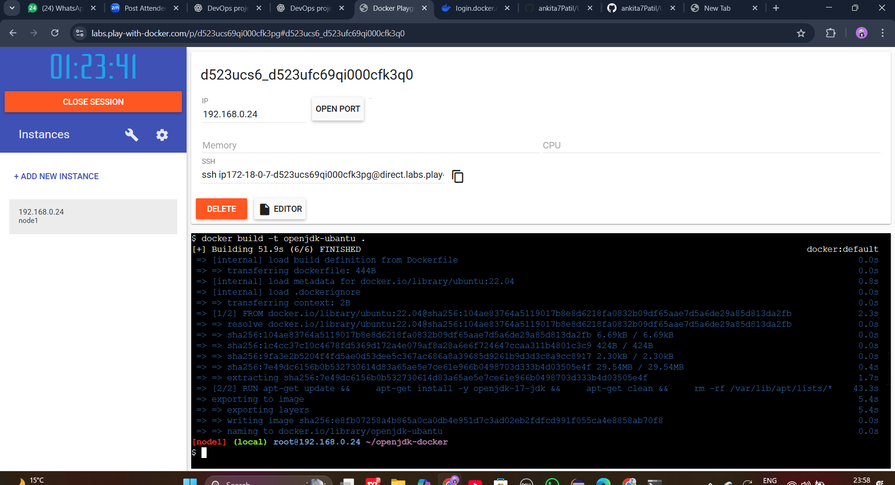

````md
# 🚀 OpenJDK Docker Image using Ubuntu


---

## 📌 Project Overview

This project demonstrates how to **build a custom Docker image** using **Ubuntu 22.04** as the base operating system and **install OpenJDK 17** inside the container.

The entire project was executed using **Play with Docker (browser-based Docker environment)** without installing Docker locally.

---

## 🛠️ Tools & Technologies

- 🐳 Docker  
- 🐧 Ubuntu 22.04  
- ☕ OpenJDK 17  
- 🌐 Play with Docker (Browser-based)

````

---

## 🧾 Dockerfile

```dockerfile
FROM ubuntu:22.04

ENV DEBIAN_FRONTEND=noninteractive

RUN apt-get update && \
    apt-get install -y openjdk-17-jdk && \
    apt-get clean && \
    rm -rf /var/lib/apt/lists/*

ENV JAVA_HOME=/usr/lib/jvm/java-17-openjdk-amd64
ENV PATH=$JAVA_HOME/bin:$PATH

CMD ["java", "-version"]
```

---

## ▶️ Steps to Build and Run

### 1️⃣ Build Docker Image

```bash
docker build -t openjdk-ubuntu .
```

📸 **Screenshot Placeholder**


---

### 2️⃣ Run Docker Container

```bash
docker run --rm openjdk-ubuntu
```

📸 **Screenshot Placeholder**


---

### 3️⃣ Verify Java Installation

Expected output:

```text
openjdk version "17.x.x"
OpenJDK Runtime Environment
OpenJDK 64-Bit Server VM
```

📸 **Screenshot Placeholder**


---

## ✅ Key Features

* Uses **Ubuntu 22.04** as base image
* Installs **OpenJDK 17**
* Lightweight and clean image
* Browser-based execution (No local Docker required)

---

## 📄 Use Case

* Learning Docker basics
* Java application containerization
* DevOps / Cloud practice
* Academic & interview projects

---

## 🧠 What I Learned

* Writing Dockerfiles
* Using Ubuntu as base image
* Installing and configuring OpenJDK
* Building and running Docker containers
* Using Play with Docker platform

---

⭐ If you like this project, give it a star!

```
```
